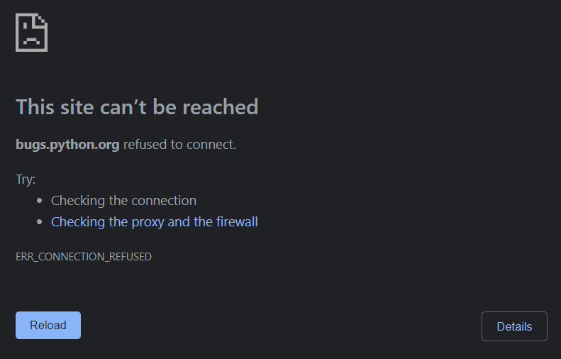

<!-- todo rewrite -->

# simple-proxy

Service for bypassing denied resources like this



## Usage

```
https://potyk-simple-proxy.herokuapp.com/?url={URL}&key={KEY}
```

- **url** param should be urlencoded 

#### Html page with relative urls replaced

```
https://potyk-simple-proxy.herokuapp.com/html?url={URL}&key={KEY}
```

## Dev 

### Install

```
poetry install
```

### Create .env

```
KEY=1488
```

### Run

```
uvicorn main:app --reload
```

### Use

```
http://127.0.0.1:8000/?url=http://bugs.python.org/&key=1488
```

### In case of new dependencies 

```
poetry export -f requirements.txt > requirements.txt --without-hashes
```
